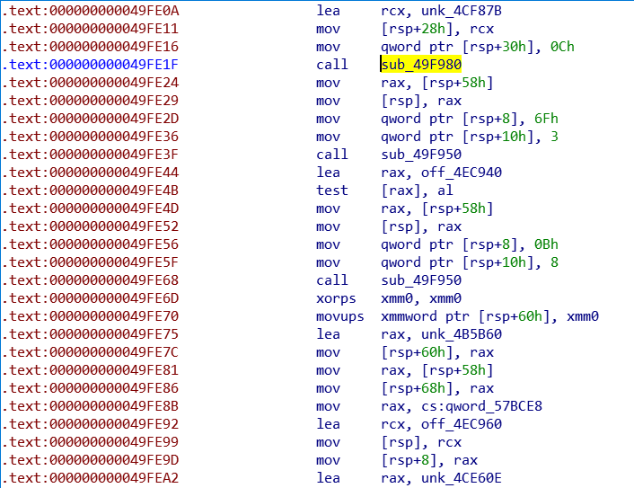
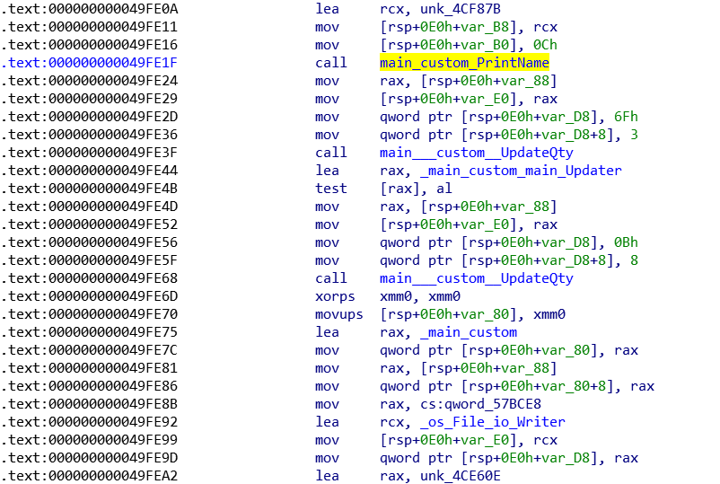

# go_moduledata_parser

Personal project to parse and extract function and type metadata from Go binaries
as JSON. Since the parser output is JSON, this allows integration with different tools.

Currently, only generation of an IDC for annotating an IDA dissassembly is supported. This IDC
can be applied to the disassembly to rename functions and types.

This branch should work from Go 1.08+ (only tested on Go 1.15). For Go 1.16,
use the go116 branch.

## Example Usage

```bash
pip3 install pyelftools pefile
python3 parser.py win64s.exe > win64s.json
```

A sample JSON can be viewed [here](integrations/ida/sample/win64s.json).

### IDA integration
```
python3 integrations/ida/generate_go_idc.py win64s.json annotate_win64s.idc
```

To use the IDC (tested on IDA Freeware only!)
* **File > Load File > Parse C header file ...** *(Ctrl+F9)* and select `go_32.h` or `go_64.h` depending on the bitness of the binary to import the necessary structs
* **View > Open subviews > Local types** *(Shift+F1)*, select all types *(Ctrl+A)* and right click **Synchronize to IDB**
* **File > Script File ...** *(Alt+F7)* and select the IDC file

#### Before



#### After

Types and functions are annotated.



## Limitations

* Assumes that only one moduledata struct in use, Go binaries can contain more than one
* Assumes that there is only one text section
* Assumes that architecture is little-endian
* Assumes that binary is built with later Go versions (currently 1.15), moduledata struct is not the same for binaries built with earlier versions
* Only tested on Windows and Linux (both x86/x64) generated from a single Go source file ...
* Code is not very Pythonic.:sweat_smile:


## Project Organization

### root

All the Python code needed for parsing the moduledata and related structures
within a Golang binary. Start from `parser.py`

### go_files

* [custom.go](go_files/custom.go) contains the sample Go code to test the parsing
and annotation
* [build.sh](go_files/build.sh) builds the Go code into stripped, unstripped versions for x86/x64 Windows and Linux
* Prebuilt binaries. Stripped binaries are suffixed with **s**.

### integrations

Currently only IDA is supported.

#### ida

* [generate_go_idc.py](integrations/ida/generate_go_idc.py) generates a IDC script from JSON for types and functions (useful for stripped binaries)
* [generate_go_idc_types.py](integrations/ida/generate_go_idc_types.py) generates a IDC script from JSON for types only (useful for unstripped binaries so that you don't rename what IDA already generated for you)
* [go_32.h](integrations/ida/go_32.h) contains the 32 bit version of the Golang structs
* [go_64.h](integrations/ida/go_64.h) contains the 64 bit version of the Golang structs
* [go_structs.h](integrations/ida/go_64.h) contains the bitness-independent
  structs for selected Golang types. Primitive data types are defined in `go_32.h` and `go_64.h`
* [sample](integrations/ida/sample) folder contains the generated JSON and IDC for a stripped Windows x64 binary

## Background

This started out as an attempt to convert the structs in Golang's source code (mainly in `runtime/type.go`, `runtime/symtab.go`, `runtime/runtime2.go`, `reflect/type.go` and `reflect/value.go`) into a header file usable by IDA and then manually identify the types from the disassembly and apply each struct by hand.

A good way to learn this stuff was to write a simple Go program using the different features of the language (see [custom.go](go_files/custom.go)) and then building with and without stripping the symbols (see [build.sh](go_files/build.sh)).

By comparing the disassembly of both binaries side-by-side, it is possible to manually identify the main functions, recognize types. etc.

After spending enough time manually annotating a stripped binary, I decided to automate most of these tasks and hence this project :smiley:

Some of the excellent articles and tools that I referred to during this project are listed below.

## References

### Reverse Engineering Articles

* https://lekstu.ga/tags/go/
* https://x0r19x91.gitlab.io/categories/golang/

### Other Good :thumbsup: Tools

* https://go-re.tk/redress/ (Windows and Linux, r2 integration)
* https://github.com/alexander-hanel/gopep (Windows only, good notes and references as well)
* https://github.com/getCUJO/ThreatIntel/tree/master/Scripts/Ghidra (Ghidra integration)
